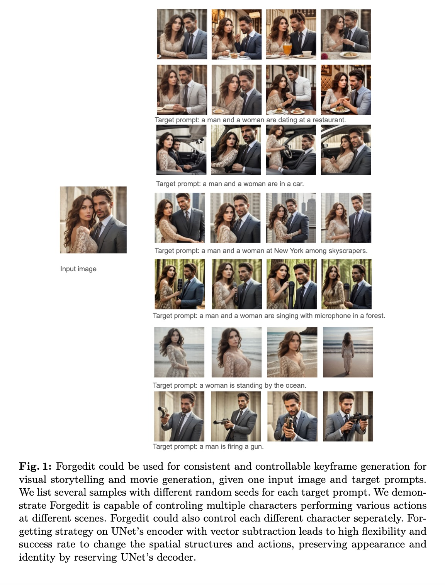
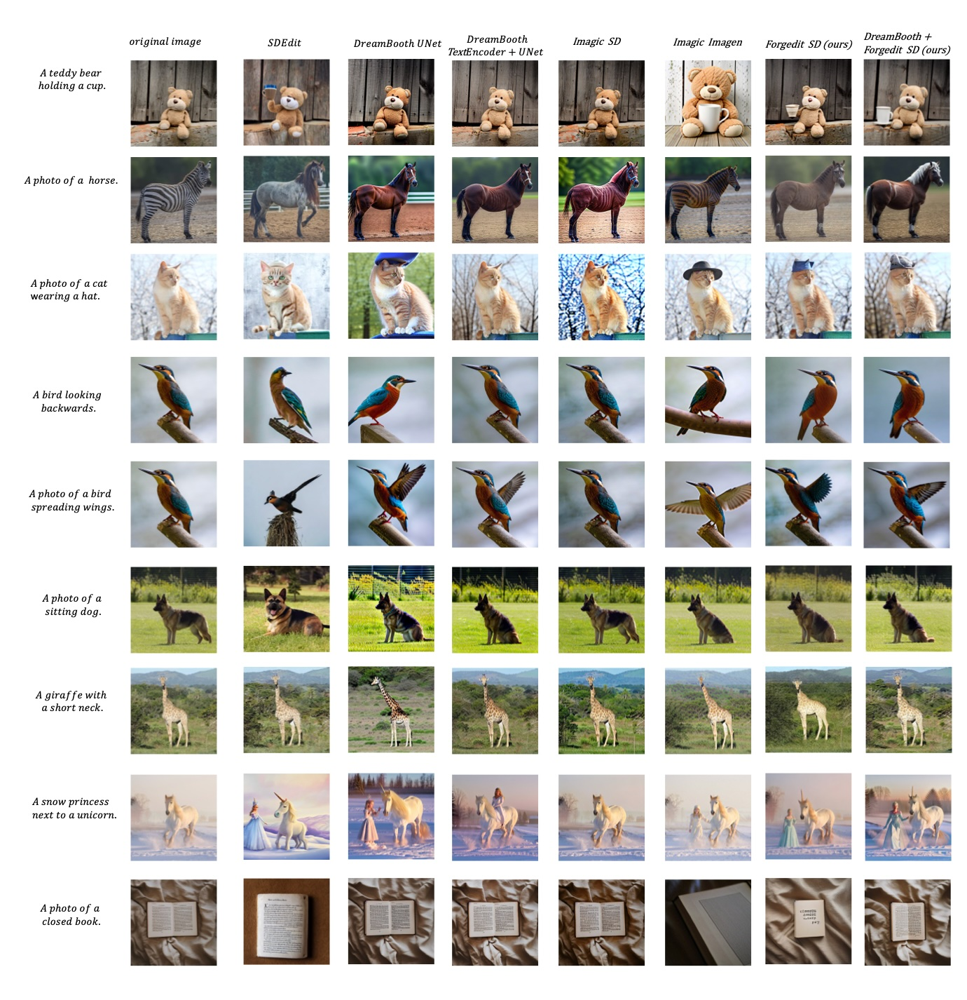

# Forgedit: Text Guided Image Editing via Learning and Forgetting

This is the official implementation of [Forgedit: Text Guided Image Editing via Learning and Forgetting](https://arxiv.org/pdf/2309.10556.pdf).

## Abstract 

Text-guided image editing on real or synthetic images, given only the original image itself and the target text prompt as inputs, is a very general and challenging task. It requires an editing model to estimate by itself which part of the image should be edited, and then perform either rigid or non-rigid editing while preserving the characteristics of original image. In this paper, we design a novel text-guided image edit- ing method, named as Forgedit. First, we propose a vision-language joint optimization framework capable of reconstructing the original image in 30 seconds, much faster than previous SOTA and much less overfitting. Then we propose a novel vector projection mechanism in text embedding space of Diffusion Models, which is capable to control the identity similarity and editing strength seperately. Finally, we discovered a general property of UNet in Diffusion Models, i.e., UNet encoder learns space and structure, UNet decoder learns appearance and identity. With such a property, we design forgetting mechanisms to successfully tackle the fatal and inevitable overfitting issues when fine-tuning Diffusion Models on one image, thus significantly boosting the editing capability of Diffusion Models. Our method, Forgedit, built on Stable Diffusion, achieves new state-of-the-art results on the challenging text-guided image editing benchmark: TEdBench, surpassing the previous SOTA methods such as Imagic with Imagen, in terms of both CLIP score and LPIPS score.




## Acknowledgement

This code is based on Diffusers implemented [Imagic](https://github.com/huggingface/diffusers/blob/main/examples/community/imagic_stable_diffusion.py)

## Installation

The code is tested with the environment of requirements.txt, which takes more than 30 seconds and fewer than 40 seconds to train a model with 512x512 image resolution on  one a100 GPU. However, it is not the best setting since previously I tested this code on alibaba cloud with one a800 GPU in a default docker environment, which was faster and took exactly 30 seconds. 

## TEdBench

The TEdBench proposed in Imagic from Google Research can be found at [TEdBench](https://github.com/imagic-editing/imagic-editing.github.io/tree/9b3b5de4ba8703e77dea7e3a2d47db0981e1f057/tedbench). The complete editing results of our vanilla Forgedit on TEdBench can be found in the [vanilla Forgedit tedbench repository](https://github.com/witcherofresearch/tedbench).   We did not use DreamBooth+Forgedit for quantitative comparison on TEdBench thus the results of DreamBooth+Forgedit are not provided. 


## Forgedit with Stable Diffusion 

To reproduce our results on TEdBench, please use Stable Diffusion 1.4.   To reproduce our results on visual storytelling, please use SG161222/Realistic_Vision_V6.0_B1_noVAE. The BLIP model is Salesforce/blip-image-captioning-base. Please note that other BLIP variants may lead to inferior performance. In this code release, vanilla Forgedit and DreamBoothForgedit are implemented. 

### vanilla Forgedit


For example, to reproduce the visual storytelling results, we train, save and edit with SG161222/Realistic_Vision_V6  model via vanilla Forgedit, text embeddings interpolation is vector subtraction, forgetting strategy is encoderkv, resolution is 768x768, gamma ranges from 0.5 to 0.7. Please note that gamma range could be different for different prompts. This training process takes more than one minute since the resolution is 768x768. If the resolution is set to 512x512, the training time should be 30 to 40 seconds on a100.

```
accelerate launch src/sample_forgedit_batch_textencoder.py --train=True --edit=True  --save=True --forget='encoderkv'  --interpolation=vs  --targeth=768 --targetw=768 --gammastart=5 --gammaend=8
```

The model will be saved to ./vanillaforgedit

To edit the image with a saved model, we use the argument --loadfrom

```
accelerate launch src/sample_forgedit_batch_textencoder.py --train=False --edit=True --save=False --forget='encoderkv' --loadfrom='/mnt/bn/editdiffusion/Forgedit/vanillaforgedit/img=test.jpg_textsteps=400_bsz=10_unetlr=6e-05_textlr=0.001' --interpolation=vs  --targeth=768 --targetw=768 --gammastart=5 --gammaend=8
```

One needs to change the img_url and prompt in the src/sample_forgedit_batch_textencoder.py.

There are 7 typical forgetting strategies implemented in src/forgedit_stable_diffusion/pipelineattentionparallel_bsz=1.py, which can be set with --forget argument. Please note the default value is --forget='donotforget' without using forgetting strategies.


### DreamBoothForgedit

To fine-tune, save and edit with DreamBoothForgedit with vector projection,


```
accelerate launch src/sample_dreambooth_batch_textencoder.py --save=True --interpolation=vp
```


To edit with saved editing models, 


```
accelerate launch src/sample_dreambooth_batch_textencoder.py --train=False --interpolation=vp
```

Forgetting strategies are implemented in src/forgedit_stable_diffusion/pipelinedreamboothparallel_bsz=1_textencoder.py,
which can be used in the freeze_list in sample_dreambooth_batch_textencoder.py




## Citation


Our paper can be found in  [Forgedit: Text Guided Image Editing via Learning and Forgetting](https://arxiv.org/pdf/2309.10556.pdf):
```
@article{zhang2023forgedit,
  title={Forgedit: Text Guided Image Editing via Learning and Forgetting},
  author={Zhang, Shiwen and Xiao, Shuai and Huang, Weilin},
  journal={arXiv preprint arXiv:2309.10556},
  year={2023}
}
```
